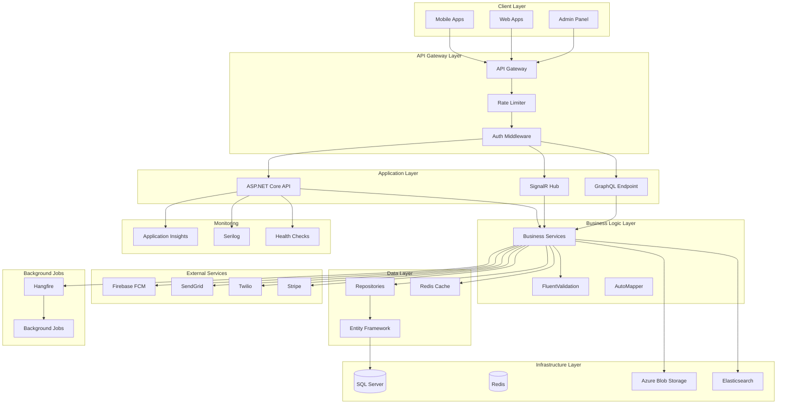
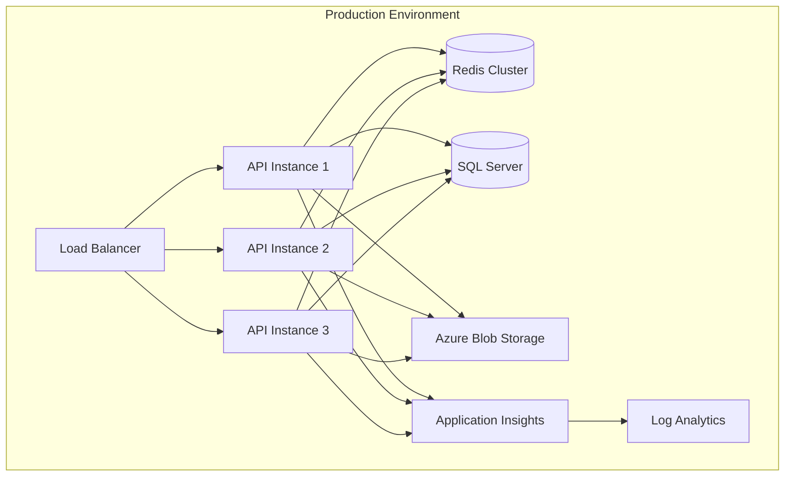

# Backend Enhancement Design Document

## Overview

Bu tasarım dokümanı, Pastella Backend'i production-ready, mobil ve web uyumlu, güvenli ve performanslı bir enterprise-grade API'ye dönüştürmek için gerekli mimari kararları ve implementasyon detaylarını içerir.

## Mobil ve Web Uyumluluk Değerlendirmesi

### ✅ Mevcut Backend - Uygun Olan Özellikler

**Mobil Uyumluluk:**
- JWT token authentication (stateless, mobil için ideal)
- RESTful API design (platform agnostic)
- JSON response format (universal support)
- Push notification infrastructure (FCM entegrasyonu)
- Async/await pattern (non-blocking operations)

**Web Uyumluluk:**
- CORS configuration (cross-origin support)
- RESTful endpoints (standard HTTP methods)
- JWT authentication (SPA uyumlu)
- Swagger documentation (API discovery)
- Docker containerization (easy deployment)

### ❌ Eksik Özellikler - Mobil ve Web İçin Gerekli

**Mobil İçin Kritik Eksiklikler:**
1. **Pagination**: Sınırsız data loading mobilde crash'e sebep olur
2. **Response Compression**: Mobil data maliyetini artırır
3. **Image Optimization**: Farklı ekran boyutları için multiple sizes gerekli
4. **Rate Limiting**: Mobil app abuse'ü önlemek için kritik
5. **Offline Sync**: Mobil connectivity issues için gerekli
6. **Field Selection**: Bandwidth optimization için sparse fieldsets

**Web İçin Kritik Eksiklikler:**
1. **WebSocket/SignalR**: Real-time updates için gerekli
2. **Response Caching**: Web performance için kritik
3. **API Versioning**: Breaking changes management
4. **GZIP Compression**: Web page load time optimization
5. **GraphQL** (optional): Flexible queries için
6. **Server-Side Events**: Alternative real-time communication

### 🎯 Sonuç: Backend Uygun mu?

**Kısa Cevap**: **Kısmen uygun, ancak production-ready değil**

**Detaylı Değerlendirme:**
- **Temel Mimari**: ✅ Uygun (Clean Architecture, RESTful design)
- **Authentication**: ✅ Uygun (JWT, refresh tokens)
- **Basic CRUD**: ✅ Uygun (Temel işlemler çalışıyor)
- **Push Notifications**: ✅ Uygun (FCM entegrasyonu var)
- **Performance**: ❌ Yetersiz (Caching, pagination yok)
- **Security**: ❌ Yetersiz (Rate limiting, validation eksik)
- **Testing**: ❌ Yok (Hiç test yok)
- **Monitoring**: ❌ Yetersiz (Basic logging only)
- **Scalability**: ❌ Hazır değil (No caching, no load balancing)

## Enhanced Architecture

### High-Level Architecture



## Technology Stack Enhancements

### New Dependencies to Add

```xml
<!-- Testing -->
<PackageReference Include="xUnit" Version="2.6.0" />
<PackageReference Include="Moq" Version="4.20.0" />
<PackageReference Include="FluentAssertions" Version="6.12.0" />
<PackageReference Include="Microsoft.AspNetCore.Mvc.Testing" Version="9.0.0" />
<PackageReference Include="Microsoft.EntityFrameworkCore.InMemory" Version="9.0.0" />

<!-- Caching -->
<PackageReference Include="StackExchange.Redis" Version="2.7.0" />
<PackageReference Include="Microsoft.Extensions.Caching.StackExchangeRedis" Version="9.0.0" />

<!-- Validation -->
<PackageReference Include="FluentValidation.AspNetCore" Version="11.3.0" />

<!-- Mapping -->
<PackageReference Include="AutoMapper.Extensions.Microsoft.DependencyInjection" Version="12.0.1" />

<!-- Logging -->
<PackageReference Include="Serilog.AspNetCore" Version="8.0.0" />
<PackageReference Include="Serilog.Sinks.ApplicationInsights" Version="4.0.0" />
<PackageReference Include="Serilog.Sinks.Seq" Version="6.0.0" />

<!-- Monitoring -->
<PackageReference Include="Microsoft.ApplicationInsights.AspNetCore" Version="2.22.0" />
<PackageReference Include="AspNetCore.HealthChecks.SqlServer" Version="8.0.0" />
<PackageReference Include="AspNetCore.HealthChecks.Redis" Version="8.0.0" />

<!-- Security -->
<PackageReference Include="AspNetCoreRateLimit" Version="5.0.0" />
<PackageReference Include="NWebsec.AspNetCore.Middleware" Version="3.0.0" />

<!-- Background Jobs -->
<PackageReference Include="Hangfire.AspNetCore" Version="1.8.6" />
<PackageReference Include="Hangfire.SqlServer" Version="1.8.6" />

<!-- Real-time -->
<PackageReference Include="Microsoft.AspNetCore.SignalR" Version="1.1.0" />

<!-- API -->
<PackageReference Include="Microsoft.AspNetCore.Mvc.Versioning" Version="5.1.0" />
<PackageReference Include="Microsoft.AspNetCore.Mvc.Versioning.ApiExplorer" Version="5.1.0" />
<PackageReference Include="HotChocolate.AspNetCore" Version="13.7.0" /> <!-- GraphQL -->

<!-- Storage -->
<PackageReference Include="Azure.Storage.Blobs" Version="12.19.0" />
<PackageReference Include="SixLabors.ImageSharp" Version="3.1.0" />

<!-- Search -->
<PackageReference Include="NEST" Version="7.17.5" /> <!-- Elasticsearch -->

<!-- Email/SMS -->
<PackageReference Include="SendGrid" Version="9.28.1" />
<PackageReference Include="Twilio" Version="6.16.0" />

<!-- Payment -->
<PackageReference Include="Stripe.net" Version="43.11.0" />

<!-- Response Compression -->
<PackageReference Include="Microsoft.AspNetCore.ResponseCompression" Version="2.2.0" />
```

## Enhanced Project Structure

```
Pastella.Backend/
├── 📁 Application/
│   ├── Services/
│   │   ├── Implementations/
│   │   └── Interfaces/
│   ├── Validators/              # ✨ NEW: FluentValidation
│   ├── Mappers/                 # ✨ NEW: AutoMapper profiles
│   ├── Commands/                # ✨ NEW: CQRS commands
│   ├── Queries/                 # ✨ NEW: CQRS queries
│   └── Behaviors/               # ✨ NEW: MediatR behaviors
├── 📁 Core/
│   ├── Entities/
│   ├── DTOs/
│   ├── Interfaces/
│   ├── Enums/                   # ✨ NEW: Enumerations
│   ├── Exceptions/              # ✨ NEW: Custom exceptions
│   └── Specifications/          # ✨ NEW: Query specifications
├── 📁 Infrastructure/
│   ├── Data/
│   │   ├── Configurations/      # ✨ NEW: EF configurations
│   │   ├── Migrations/
│   │   └── Seed/                # ✨ NEW: Data seeding
│   ├── Repositories/
│   ├── ExternalServices/
│   │   ├── Email/               # ✨ NEW: Email service
│   │   ├── SMS/                 # ✨ NEW: SMS service
│   │   ├── Storage/             # ✨ NEW: File storage
│   │   ├── Payment/             # ✨ NEW: Payment gateway
│   │   └── Search/              # ✨ NEW: Search engine
│   ├── Caching/                 # ✨ NEW: Cache implementations
│   └── BackgroundJobs/          # ✨ NEW: Hangfire jobs
├── 📁 WebAPI/
│   ├── Controllers/
│   │   ├── v1/                  # ✨ NEW: API versioning
│   │   └── v2/
│   ├── Hubs/                    # ✨ NEW: SignalR hubs
│   ├── GraphQL/                 # ✨ NEW: GraphQL schema
│   ├── Middlewares/
│   │   ├── ErrorHandlingMiddleware.cs    # ✨ NEW
│   │   ├── RequestLoggingMiddleware.cs   # ✨ NEW
│   │   └── PerformanceMiddleware.cs      # ✨ NEW
│   ├── Filters/                 # ✨ NEW: Action filters
│   ├── Configurations/
│   └── Extensions/              # ✨ NEW: Extension methods
├── 📁 Tests/                    # ✨ NEW: Test projects
│   ├── UnitTests/
│   ├── IntegrationTests/
│   └── ApiTests/
└── 📁 Shared/                   # ✨ NEW: Shared utilities
    ├── Constants/
    ├── Helpers/
    └── Extensions/
```

## Core Enhancements

### 1. Testing Infrastructure

#### Unit Testing Strategy
```csharp
// Example: Service Unit Test
public class OrderServiceTests
{
    private readonly Mock<IOrderRepository> _orderRepositoryMock;
    private readonly Mock<INotificationService> _notificationServiceMock;
    private readonly OrderService _sut;

    [Fact]
    public async Task CreateOrder_ValidOrder_ReturnsOrderDto()
    {
        // Arrange
        var createOrderDto = new CreateOrderDto { /* ... */ };
        var expectedOrder = new Order { /* ... */ };
        
        _orderRepositoryMock
            .Setup(x => x.Create(It.IsAny<Order>()))
            .ReturnsAsync(expectedOrder);

        // Act
        var result = await _sut.CreateOrder(createOrderDto, 1);

        // Assert
        result.Should().NotBeNull();
        result.Id.Should().Be(expectedOrder.Id);
        _orderRepositoryMock.Verify(x => x.Create(It.IsAny<Order>()), Times.Once);
    }
}
```

#### Integration Testing Strategy
```csharp
// Example: API Integration Test
public class OrderControllerTests : IClassFixture<WebApplicationFactory<Program>>
{
    private readonly HttpClient _client;

    [Fact]
    public async Task CreateOrder_AuthenticatedUser_ReturnsCreated()
    {
        // Arrange
        var token = await GetAuthToken();
        _client.DefaultRequestHeaders.Authorization = 
            new AuthenticationHeaderValue("Bearer", token);
        
        var orderDto = new CreateOrderDto { /* ... */ };

        // Act
        var response = await _client.PostAsJsonAsync("/api/v1/orders", orderDto);

        // Assert
        response.StatusCode.Should().Be(HttpStatusCode.Created);
    }
}
```

### 2. Caching Strategy

#### Multi-Level Caching Implementation
```csharp
public class CachedOrderService : IOrderService
{
    private readonly IOrderService _orderService;
    private readonly IDistributedCache _cache;
    private readonly IMemoryCache _memoryCache;

    public async Task<OrderDto> GetOrderById(int id)
    {
        // L1: Memory Cache (fastest)
        if (_memoryCache.TryGetValue($"order:{id}", out OrderDto cachedOrder))
            return cachedOrder;

        // L2: Redis Cache (shared across instances)
        var cacheKey = $"order:{id}";
        var cachedData = await _cache.GetStringAsync(cacheKey);
        
        if (cachedData != null)
        {
            var order = JsonSerializer.Deserialize<OrderDto>(cachedData);
            _memoryCache.Set($"order:{id}", order, TimeSpan.FromMinutes(5));
            return order;
        }

        // L3: Database (slowest)
        var result = await _orderService.GetOrderById(id);
        
        // Cache the result
        await _cache.SetStringAsync(
            cacheKey,
            JsonSerializer.Serialize(result),
            new DistributedCacheEntryOptions
            {
                AbsoluteExpirationRelativeToNow = TimeSpan.FromHours(1)
            });
        
        _memoryCache.Set($"order:{id}", result, TimeSpan.FromMinutes(5));
        
        return result;
    }
}
```

### 3. Security Enhancements

#### Rate Limiting Configuration
```csharp
// Startup.cs
services.AddMemoryCache();
services.Configure<IpRateLimitOptions>(options =>
{
    options.EnableEndpointRateLimiting = true;
    options.StackBlockedRequests = false;
    options.HttpStatusCode = 429;
    options.RealIpHeader = "X-Real-IP";
    options.GeneralRules = new List<RateLimitRule>
    {
        new RateLimitRule
        {
            Endpoint = "*",
            Period = "1m",
            Limit = 60
        },
        new RateLimitRule
        {
            Endpoint = "*/api/auth/*",
            Period = "1m",
            Limit = 10
        }
    };
});
```

#### Input Validation with FluentValidation
```csharp
public class CreateOrderDtoValidator : AbstractValidator<CreateOrderDto>
{
    public CreateOrderDtoValidator()
    {
        RuleFor(x => x.CakeId)
            .GreaterThan(0)
            .WithMessage("Valid cake ID is required");

        RuleFor(x => x.TotalPrice)
            .GreaterThan(0)
            .WithMessage("Total price must be greater than zero");

        RuleFor(x => x.DeliveryDate)
            .GreaterThan(DateTime.Now)
            .WithMessage("Delivery date must be in the future");

        RuleFor(x => x.DeliveryAddress)
            .NotEmpty()
            .MaximumLength(500)
            .WithMessage("Delivery address is required");
    }
}
```

#### Security Headers Middleware
```csharp
app.UseHsts();
app.UseXContentTypeOptions();
app.UseReferrerPolicy(opts => opts.NoReferrer());
app.UseXXssProtection(opts => opts.EnabledWithBlockMode());
app.UseXfo(opts => opts.Deny());
app.UseCsp(opts => opts
    .BlockAllMixedContent()
    .StyleSources(s => s.Self())
    .ScriptSources(s => s.Self())
    .FontSources(s => s.Self())
    .ImageSources(s => s.Self())
);
```

### 4. Performance Optimizations

#### Pagination Implementation
```csharp
public class PagedResult<T>
{
    public List<T> Items { get; set; }
    public int PageNumber { get; set; }
    public int PageSize { get; set; }
    public int TotalPages { get; set; }
    public int TotalCount { get; set; }
    public bool HasPrevious => PageNumber > 1;
    public bool HasNext => PageNumber < TotalPages;
}

public async Task<PagedResult<OrderDto>> GetOrders(int pageNumber, int pageSize)
{
    var query = _context.Orders.AsQueryable();
    var totalCount = await query.CountAsync();
    
    var items = await query
        .Skip((pageNumber - 1) * pageSize)
        .Take(pageSize)
        .ProjectTo<OrderDto>(_mapper.ConfigurationProvider)
        .ToListAsync();

    return new PagedResult<OrderDto>
    {
        Items = items,
        PageNumber = pageNumber,
        PageSize = pageSize,
        TotalCount = totalCount,
        TotalPages = (int)Math.Ceiling(totalCount / (double)pageSize)
    };
}
```

#### Response Compression
```csharp
services.AddResponseCompression(options =>
{
    options.EnableForHttps = true;
    options.Providers.Add<GzipCompressionProvider>();
    options.Providers.Add<BrotliCompressionProvider>();
    options.MimeTypes = ResponseCompressionDefaults.MimeTypes.Concat(
        new[] { "application/json" });
});

services.Configure<GzipCompressionProviderOptions>(options =>
{
    options.Level = CompressionLevel.Fastest;
});
```

### 5. Mobile-Specific Features

#### Field Selection (Sparse Fieldsets)
```csharp
[HttpGet]
public async Task<IActionResult> GetOrders([FromQuery] string fields)
{
    var orders = await _orderService.GetAllAsync();
    
    if (!string.IsNullOrEmpty(fields))
    {
        var selectedFields = fields.Split(',');
        var result = orders.Select(o => SelectFields(o, selectedFields));
        return Ok(result);
    }
    
    return Ok(orders);
}

private dynamic SelectFields(object obj, string[] fields)
{
    var expando = new ExpandoObject() as IDictionary<string, object>;
    var properties = obj.GetType().GetProperties();
    
    foreach (var field in fields)
    {
        var property = properties.FirstOrDefault(p => 
            p.Name.Equals(field, StringComparison.OrdinalIgnoreCase));
        
        if (property != null)
        {
            expando[property.Name] = property.GetValue(obj);
        }
    }
    
    return expando;
}
```

#### Image Optimization for Mobile
```csharp
public class ImageService : IImageService
{
    private readonly IBlobStorageService _blobStorage;

    public async Task<ImageUrls> UploadAndOptimize(IFormFile file)
    {
        using var image = await Image.LoadAsync(file.OpenReadStream());
        
        var sizes = new Dictionary<string, int>
        {
            { "thumbnail", 150 },
            { "small", 300 },
            { "medium", 600 },
            { "large", 1200 },
            { "original", 0 }
        };

        var urls = new ImageUrls();
        
        foreach (var size in sizes)
        {
            var resized = size.Value > 0 
                ? image.Clone(x => x.Resize(size.Value, 0))
                : image;
            
            using var ms = new MemoryStream();
            await resized.SaveAsWebpAsync(ms);
            ms.Position = 0;
            
            var url = await _blobStorage.UploadAsync(
                ms, 
                $"{Guid.NewGuid()}_{size.Key}.webp");
            
            urls[size.Key] = url;
        }
        
        return urls;
    }
}
```

### 6. Web-Specific Features

#### SignalR Hub for Real-Time Updates
```csharp
public class OrderHub : Hub
{
    private readonly IOrderService _orderService;

    public async Task SubscribeToOrder(int orderId)
    {
        await Groups.AddToGroupAsync(Context.ConnectionId, $"order_{orderId}");
    }

    public async Task UnsubscribeFromOrder(int orderId)
    {
        await Groups.RemoveFromGroupAsync(Context.ConnectionId, $"order_{orderId}");
    }

    public async Task NotifyOrderUpdate(int orderId, string status)
    {
        await Clients.Group($"order_{orderId}")
            .SendAsync("OrderUpdated", new { orderId, status });
    }
}
```

#### GraphQL Implementation (Optional)
```csharp
public class Query
{
    [UseProjection]
    [UseFiltering]
    [UseSorting]
    public IQueryable<Order> GetOrders([Service] ApplicationDbContext context)
    {
        return context.Orders;
    }

    public async Task<Order> GetOrder(
        int id,
        [Service] ApplicationDbContext context)
    {
        return await context.Orders.FindAsync(id);
    }
}

public class Mutation
{
    public async Task<Order> CreateOrder(
        CreateOrderInput input,
        [Service] IOrderService orderService)
    {
        return await orderService.CreateAsync(input);
    }
}
```

### 7. Monitoring and Observability

#### Structured Logging with Serilog
```csharp
Log.Logger = new LoggerConfiguration()
    .MinimumLevel.Information()
    .MinimumLevel.Override("Microsoft", LogEventLevel.Warning)
    .Enrich.FromLogContext()
    .Enrich.WithMachineName()
    .Enrich.WithEnvironmentName()
    .WriteTo.Console()
    .WriteTo.Seq("http://localhost:5341")
    .WriteTo.ApplicationInsights(TelemetryConfiguration.Active, TelemetryConverter.Traces)
    .CreateLogger();
```

#### Health Checks
```csharp
services.AddHealthChecks()
    .AddSqlServer(
        connectionString: Configuration.GetConnectionString("DefaultConnection"),
        name: "sql-server",
        tags: new[] { "db", "sql", "sqlserver" })
    .AddRedis(
        redisConnectionString: Configuration.GetConnectionString("Redis"),
        name: "redis",
        tags: new[] { "cache", "redis" })
    .AddAzureBlobStorage(
        connectionString: Configuration.GetConnectionString("BlobStorage"),
        name: "blob-storage",
        tags: new[] { "storage", "blob" });

app.MapHealthChecks("/health", new HealthCheckOptions
{
    ResponseWriter = UIResponseWriter.WriteHealthCheckUIResponse
});
```

### 8. Background Jobs with Hangfire

```csharp
// Startup configuration
services.AddHangfire(config => config
    .SetDataCompatibilityLevel(CompatibilityLevel.Version_170)
    .UseSimpleAssemblyNameTypeSerializer()
    .UseRecommendedSerializerSettings()
    .UseSqlServerStorage(Configuration.GetConnectionString("DefaultConnection")));

services.AddHangfireServer();

// Job definitions
public class EmailJob
{
    private readonly IEmailService _emailService;

    [AutomaticRetry(Attempts = 3)]
    public async Task SendOrderConfirmation(int orderId)
    {
        var order = await _orderService.GetByIdAsync(orderId);
        await _emailService.SendOrderConfirmationAsync(order);
    }
}

// Job scheduling
BackgroundJob.Enqueue<EmailJob>(x => x.SendOrderConfirmation(orderId));
RecurringJob.AddOrUpdate<BirthdayReminderJob>(
    "birthday-reminders",
    x => x.SendBirthdayReminders(),
    Cron.Daily);
```

## API Versioning Strategy

```csharp
services.AddApiVersioning(options =>
{
    options.DefaultApiVersion = new ApiVersion(1, 0);
    options.AssumeDefaultVersionWhenUnspecified = true;
    options.ReportApiVersions = true;
    options.ApiVersionReader = ApiVersionReader.Combine(
        new UrlSegmentApiVersionReader(),
        new HeaderApiVersionReader("X-Api-Version"));
});

// Controller example
[ApiController]
[ApiVersion("1.0")]
[Route("api/v{version:apiVersion}/[controller]")]
public class OrdersV1Controller : ControllerBase
{
    // V1 implementation
}

[ApiController]
[ApiVersion("2.0")]
[Route("api/v{version:apiVersion}/[controller]")]
public class OrdersV2Controller : ControllerBase
{
    // V2 implementation with breaking changes
}
```

## Deployment Architecture



## Conclusion

Bu tasarım dokümanı, Pastella Backend'i production-ready, mobil ve web uyumlu bir enterprise-grade API'ye dönüştürmek için gerekli tüm mimari kararları ve implementasyon detaylarını içermektedir. Önerilen değişiklikler uygulandığında, backend hem mobil hem de web uygulamaları için optimize edilmiş, güvenli, performanslı ve ölçeklenebilir bir sistem haline gelecektir.