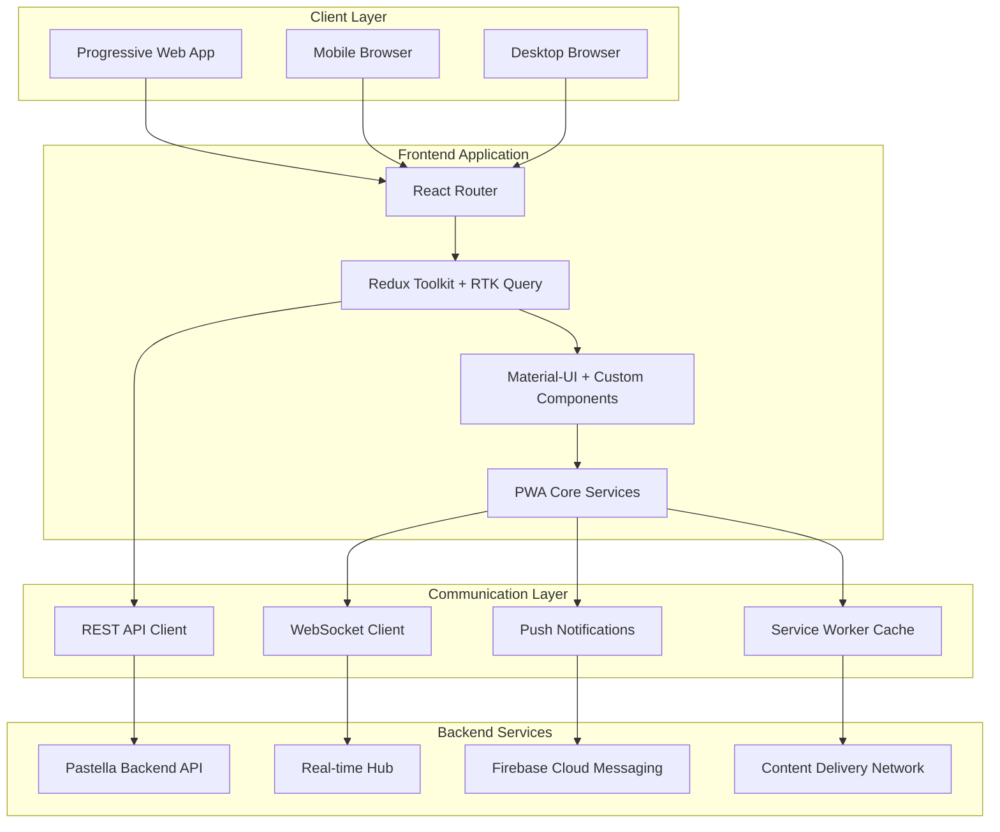
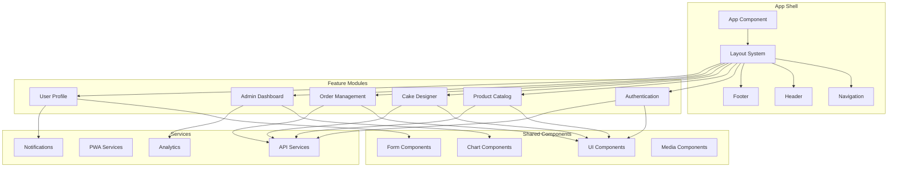

# Design Document

## Overview

Pastella Frontend is a high-performance, multi-platform Progressive Web Application (PWA) built with modern web technologies. The system serves three distinct user types (customers, bakery owners, and administrators) through a unified, responsive interface optimized for mobile-first experiences. The architecture emphasizes real-time capabilities, offline functionality, and enterprise-grade performance suitable for commercial deployment.

## Architecture

### High-Level Architecture



### Technology Stack

#### Core Framework
- **React 18**: Latest React with Concurrent Features and Suspense
- **TypeScript**: Full type safety and enhanced developer experience
- **Vite**: Ultra-fast build tool with HMR and optimized production builds
- **PWA Vite Plugin**: Progressive Web App capabilities with service worker

#### State Management
- **Redux Toolkit**: Modern Redux with simplified API
- **RTK Query**: Powerful data fetching and caching solution
- **Redux Persist**: State persistence across sessions
- **Immer**: Immutable state updates

#### UI Framework
- **Material-UI (MUI) v5**: Comprehensive React component library
- **Emotion**: CSS-in-JS styling solution
- **Framer Motion**: Advanced animations and transitions
- **React Hook Form**: Performant form handling with validation

#### Real-time Communication
- **Socket.IO Client**: WebSocket communication with fallbacks
- **Microsoft SignalR Client**: Real-time communication with .NET backend
- **React Query**: Server state synchronization and caching

#### PWA and Performance
- **Workbox**: Service worker management and caching strategies
- **Web Vitals**: Core Web Vitals monitoring
- **React Lazy**: Code splitting and lazy loading
- **React Virtualized**: Efficient rendering of large lists

#### Development Tools
- **ESLint + Prettier**: Code quality and formatting
- **Husky**: Git hooks for quality gates
- **Jest + React Testing Library**: Unit and integration testing
- **Cypress**: End-to-end testing
- **Storybook**: Component development and documentation

## Components and Interfaces

### Component Architecture



### Core Components

#### 1. App Shell Components
- **AppShell**: Main application wrapper with PWA initialization
- **LayoutManager**: Responsive layout system with breakpoint handling
- **NavigationDrawer**: Collapsible navigation with role-based menu items
- **TopBar**: Header with search, notifications, and user menu
- **BottomNavigation**: Mobile-optimized bottom navigation

#### 2. Authentication Components
- **LoginForm**: Secure login with biometric support
- **RegisterForm**: Multi-step registration with validation
- **PasswordReset**: Password recovery flow
- **TwoFactorAuth**: Optional 2FA implementation
- **SocialLogin**: OAuth integration (Google, Facebook, Apple)

#### 3. Product Catalog Components
- **ProductGrid**: Virtualized grid with infinite scroll
- **ProductCard**: Optimized product display with lazy loading
- **FilterPanel**: Advanced filtering with real-time updates
- **SearchBar**: Intelligent search with autocomplete
- **CategoryBrowser**: Hierarchical category navigation

#### 4. Cake Designer Components
- **DesignCanvas**: 3D cake visualization using Three.js
- **ShapeSelector**: Interactive shape selection
- **ColorPicker**: Advanced color selection with presets
- **DecorationLibrary**: Drag-and-drop decoration system
- **DesignPreview**: Real-time 3D preview with lighting
- **DesignSaver**: Save and share design functionality

#### 5. Order Management Components
- **OrderWizard**: Multi-step order creation
- **CartManager**: Shopping cart with real-time updates
- **CheckoutFlow**: Secure checkout with payment integration
- **OrderTracker**: Real-time order status tracking
- **OrderHistory**: Paginated order history with search

#### 6. Dashboard Components
- **MetricCards**: Key performance indicators
- **RevenueChart**: Interactive revenue analytics
- **OrderStatusBoard**: Kanban-style order management
- **InventoryManager**: Real-time inventory tracking
- **CustomerInsights**: Customer behavior analytics

### Interface Definitions

#### API Client Interface
```typescript
interface ApiClient {
  // Authentication
  login(credentials: LoginCredentials): Promise<AuthResponse>
  register(userData: RegisterData): Promise<AuthResponse>
  refreshToken(): Promise<TokenResponse>
  
  // Products
  getProducts(filters?: ProductFilters): Promise<Product[]>
  getProduct(id: string): Promise<Product>
  searchProducts(query: string): Promise<SearchResult[]>
  
  // Orders
  createOrder(orderData: CreateOrderData): Promise<Order>
  getOrders(userId?: string): Promise<Order[]>
  updateOrderStatus(orderId: string, status: OrderStatus): Promise<void>
  
  // Designs
  saveDesign(design: CakeDesign): Promise<Design>
  getDesigns(userId?: string): Promise<Design[]>
  shareDesign(designId: string): Promise<ShareLink>
  
  // Real-time
  subscribeToOrderUpdates(callback: (update: OrderUpdate) => void): void
  subscribeToNotifications(callback: (notification: Notification) => void): void
}
```

#### State Management Interface
```typescript
interface AppState {
  auth: AuthState
  products: ProductState
  orders: OrderState
  designs: DesignState
  ui: UIState
  cache: CacheState
}

interface AuthState {
  user: User | null
  token: string | null
  isAuthenticated: boolean
  permissions: Permission[]
}

interface ProductState {
  items: Product[]
  filters: ProductFilters
  searchResults: SearchResult[]
  loading: boolean
  error: string | null
}
```

## Data Models

### Core Data Models

#### User Model
```typescript
interface User {
  id: string
  email: string
  fullName: string
  role: 'Customer' | 'BakeryOwner' | 'Admin'
  avatar?: string
  preferences: UserPreferences
  addresses: Address[]
  paymentMethods: PaymentMethod[]
  createdAt: Date
  lastLoginAt: Date
}

interface UserPreferences {
  language: string
  currency: string
  notifications: NotificationSettings
  theme: 'light' | 'dark' | 'auto'
  accessibility: AccessibilitySettings
}
```

#### Product Model
```typescript
interface Product {
  id: string
  name: string
  description: string
  price: number
  currency: string
  images: ProductImage[]
  category: Category
  tags: string[]
  availability: Availability
  nutrition?: NutritionInfo
  allergens: string[]
  customizable: boolean
  rating: number
  reviewCount: number
  bakery: BakeryInfo
}

interface ProductImage {
  id: string
  url: string
  alt: string
  width: number
  height: number
  format: 'webp' | 'jpg' | 'png'
  sizes: ImageSize[]
}
```

#### Order Model
```typescript
interface Order {
  id: string
  orderNumber: string
  userId: string
  items: OrderItem[]
  totalAmount: number
  currency: string
  status: OrderStatus
  deliveryAddress: Address
  deliveryDate: Date
  specialInstructions?: string
  paymentStatus: PaymentStatus
  trackingInfo: TrackingInfo
  createdAt: Date
  updatedAt: Date
}

interface OrderItem {
  id: string
  productId?: string
  designId?: string
  quantity: number
  unitPrice: number
  customizations: Customization[]
  notes?: string
}

type OrderStatus = 
  | 'pending'
  | 'confirmed'
  | 'preparing'
  | 'baking'
  | 'decorating'
  | 'ready'
  | 'out_for_delivery'
  | 'delivered'
  | 'cancelled'
```

#### Cake Design Model
```typescript
interface CakeDesign {
  id: string
  name: string
  userId: string
  shape: CakeShape
  size: CakeSize
  layers: CakeLayer[]
  decorations: Decoration[]
  colors: ColorScheme
  text?: CakeText
  price: number
  isPublic: boolean
  shareLink?: string
  previewImage: string
  createdAt: Date
  updatedAt: Date
}

interface CakeLayer {
  id: string
  flavor: string
  filling?: string
  height: number
  diameter: number
}

interface Decoration {
  id: string
  type: DecorationType
  position: Position3D
  scale: number
  rotation: number
  color: string
  texture?: string
}
```

### State Models

#### UI State Model
```typescript
interface UIState {
  theme: ThemeMode
  language: string
  loading: LoadingState
  notifications: NotificationState
  modals: ModalState
  navigation: NavigationState
  viewport: ViewportState
}

interface LoadingState {
  global: boolean
  components: Record<string, boolean>
  operations: Record<string, boolean>
}

interface NotificationState {
  items: Notification[]
  unreadCount: number
  settings: NotificationSettings
}
```

#### Cache State Model
```typescript
interface CacheState {
  products: CacheEntry<Product[]>
  categories: CacheEntry<Category[]>
  user: CacheEntry<User>
  orders: CacheEntry<Order[]>
  designs: CacheEntry<CakeDesign[]>
}

interface CacheEntry<T> {
  data: T
  timestamp: number
  expiry: number
  version: string
}
```

## Correctness Properties

*A property is a characteristic or behavior that should hold true across all valid executions of a system-essentially, a formal statement about what the system should do. Properties serve as the bridge between human-readable specifications and machine-verifiable correctness guarantees.*

### Performance Properties

**Property 1: Mobile Homepage Load Time**
*For any* mobile device configuration and network condition, when a customer visits the application homepage, the page should load completely within 2 seconds
**Validates: Requirements 1.1**

**Property 2: 3D Design Studio Load Time**
*For any* device configuration, when a customer accesses the design studio, the 3D cake builder should load within 3 seconds
**Validates: Requirements 2.1**

**Property 3: Search Autocomplete Response Time**
*For any* search query, when a customer types in the search field, autocomplete suggestions should appear within 200ms
**Validates: Requirements 8.1**

**Property 4: Payment Options Load Time**
*For any* checkout session, when a customer proceeds to payment, payment options should load within 1 second
**Validates: Requirements 10.1**

**Property 5: Analytics Chart Load Time**
*For any* data size, when a bakery owner views analytics, charts should load within 1 second
**Validates: Requirements 4.4**

**Property 6: High Traffic Performance**
*For any* traffic load, when the system experiences high usage, response times should remain under 3 seconds
**Validates: Requirements 11.1**

### Real-Time System Properties

**Property 7: Cart Update Responsiveness**
*For any* cart modification, when a customer adds items to cart, the cart totals should update instantly without page refresh
**Validates: Requirements 1.4**

**Property 8: 3D Shape Rendering**
*For any* shape selection, when a customer selects cake shapes, 3D previews should render in real-time
**Validates: Requirements 2.2**

**Property 9: Decoration Preview Updates**
*For any* decoration change, when a customer applies decorations, the visual preview should update instantly
**Validates: Requirements 2.3**

**Property 10: Color Change Visualization**
*For any* color modification, when a customer modifies colors, live color changes should appear on the 3D model immediately
**Validates: Requirements 2.5**

**Property 11: Order Status Notifications**
*For any* order status change, when an order status updates, customers should receive push notifications instantly
**Validates: Requirements 3.1**

**Property 12: Live Order Tracking**
*For any* order tracking request, when a customer views order tracking, live progress updates should display automatically
**Validates: Requirements 3.2**

**Property 13: Real-Time Location Tracking**
*For any* delivery in progress, when delivery starts, real-time location tracking should display and update continuously
**Validates: Requirements 3.3**

**Property 14: Bakery Owner Order Notifications**
*For any* new order, when orders arrive, bakery owners should receive immediate notifications
**Validates: Requirements 4.2**

**Property 15: Customer Status Update Notifications**
*For any* status update, when bakery owners update order status, customers should receive instant notifications
**Validates: Requirements 4.3**

**Property 16: Inventory Updates**
*For any* inventory change, when bakery owners manage inventory, product availability should update in real-time
**Validates: Requirements 4.5**

**Property 17: Admin Dashboard Updates**
*For any* system metric change, when admins view system metrics, dashboards should render real-time updates
**Validates: Requirements 5.2**

**Property 18: Targeted Notification Delivery**
*For any* notification campaign, when admins send notifications, they should deliver to targeted user groups instantly
**Validates: Requirements 5.4**

**Property 19: Language Switching**
*For any* language change, when customers change language, all content should update without page reload
**Validates: Requirements 7.2**

**Property 20: Filter Result Updates**
*For any* filter application, when customers apply filters, results should update instantly without page reload
**Validates: Requirements 8.2**

**Property 21: Engagement Metric Updates**
*For any* user interaction, when customers like or comment, engagement metrics should update instantly
**Validates: Requirements 9.4**

**Property 22: Payment Validation**
*For any* payment detail entry, when customers enter payment details, validation should occur in real-time
**Validates: Requirements 10.2**

**Property 23: Business Metric Updates**
*For any* metric calculation, when business metrics are calculated, dashboards should update in real-time
**Validates: Requirements 13.2**

### PWA and Offline Properties

**Property 24: Offline Content Access**
*For any* offline condition, when customers are offline, cached content should remain accessible and basic navigation should work
**Validates: Requirements 1.5, 6.2**

**Property 25: PWA Installation Prompts**
*For any* supported device, when customers visit the site, PWA installation prompts should appear
**Validates: Requirements 6.1**

**Property 26: Push Notification Display**
*For any* push notification, when customers receive notifications, they should display in the device notification center even when the app is closed
**Validates: Requirements 3.4, 6.3**

**Property 27: Fullscreen App Launch**
*For any* installed PWA, when customers open the installed app, it should launch in fullscreen mode without browser UI
**Validates: Requirements 6.4**

**Property 28: Automatic Updates**
*For any* app update, when updates are available, the PWA should update automatically in the background
**Validates: Requirements 6.5**

### Data Isolation and Security Properties

**Property 29: Multi-Tenant Data Isolation**
*For any* bakery owner login, when they access the system, only their bakery's data should be displayed
**Validates: Requirements 4.1**

**Property 30: Admin Data Aggregation**
*For any* admin access, when admins access the control panel, aggregated data from all bakeries should be displayed
**Validates: Requirements 5.1**

**Property 31: Secure Payment Processing**
*For any* payment completion, when customers complete payments, they should be processed securely using PCI-compliant methods
**Validates: Requirements 10.3**

**Property 32: Secure Payment Storage**
*For any* saved payment method, when customers save payment methods, they should be encrypted and stored securely
**Validates: Requirements 10.5**

### Functionality Properties

**Property 33: Infinite Scroll with Lazy Loading**
*For any* category browsing, when customers browse cake categories, infinite scroll should display with lazy loading of images
**Validates: Requirements 1.2**

**Property 34: High-Quality Image Display**
*For any* cake detail view, when customers view cake details, high-quality images with zoom functionality should be shown
**Validates: Requirements 1.3**

**Property 35: Design Link Generation**
*For any* design save operation, when customers save designs, a shareable design link should be generated
**Validates: Requirements 2.4**

**Property 36: Notification Batching**
*For any* multiple status updates, when rapid updates occur, the system should batch updates to prevent notification spam
**Validates: Requirements 3.5**

**Property 37: Bulk Operations Efficiency**
*For any* bulk operation, when admins manage users, bulk operations should complete efficiently within reasonable time limits
**Validates: Requirements 5.3**

**Property 38: Non-Blocking Report Generation**
*For any* data export, when admins export data, reports should generate without blocking the UI
**Validates: Requirements 5.5**

**Property 39: Language Detection**
*For any* app visit, when customers visit the app, their language preference should be detected automatically
**Validates: Requirements 7.1**

**Property 40: Currency Localization**
*For any* price display, when customers view prices, they should be displayed in local currency
**Validates: Requirements 7.3**

**Property 41: Address Format Validation**
*For any* address entry, when customers enter addresses, validation should use local address formats
**Validates: Requirements 7.4**

**Property 42: Date Format Localization**
*For any* date selection, when customers select dates, local date and time formats should be used
**Validates: Requirements 7.5**

**Property 43: Image Search Functionality**
*For any* image search, when customers search by image, similar cakes should be found using AI
**Validates: Requirements 8.3**

**Property 44: Voice Search Accuracy**
*For any* voice search, when customers use voice search, speech should be converted to text accurately
**Validates: Requirements 8.4**

**Property 45: Search Preference Persistence**
*For any* saved preference, when customers save search preferences, they should be remembered across sessions
**Validates: Requirements 8.5**

**Property 46: Review Prompting**
*For any* completed order, when customers complete orders, they should be prompted for review with photo upload
**Validates: Requirements 9.1**

**Property 47: Social Media Image Generation**
*For any* design sharing, when customers share cake designs, social media optimized images should be generated
**Validates: Requirements 9.2**

**Property 48: Verified Purchase Badges**
*For any* review display, when customers view reviews, they should be displayed with verified purchase badges
**Validates: Requirements 9.3**

**Property 49: Content Moderation Flagging**
*For any* inappropriate content report, when customers report content, it should be flagged for moderation
**Validates: Requirements 9.5**

**Property 50: Payment Error Handling**
*For any* payment failure, when payments fail, clear error messages and retry options should be provided
**Validates: Requirements 10.4**

### Performance Optimization Properties

**Property 51: WebP Image Optimization**
*For any* image loading, when images are loaded, WebP format with fallbacks should be used for optimization
**Validates: Requirements 11.2**

**Property 52: Code Splitting Implementation**
*For any* JavaScript bundle serving, when bundles are served, code splitting and lazy loading should be implemented
**Validates: Requirements 11.3**

**Property 53: Intelligent Caching**
*For any* API call, when API calls are made, intelligent caching strategies should be implemented
**Validates: Requirements 11.4**

**Property 54: Horizontal Scaling Support**
*For any* system scaling, when the system scales, horizontal scaling should be supported without performance degradation
**Validates: Requirements 11.5**

### Accessibility Properties

**Property 55: Keyboard Navigation**
*For any* keyboard navigation, when users navigate with keyboard, clear focus indicators and logical tab order should be provided
**Validates: Requirements 12.1**

**Property 56: Screen Reader Support**
*For any* screen reader usage, when users use screen readers, comprehensive ARIA labels and descriptions should be provided
**Validates: Requirements 12.2**

**Property 57: Visual Accessibility Support**
*For any* visual impairment, when users have visual impairments, high contrast mode and text scaling should be supported
**Validates: Requirements 12.3**

**Property 58: Motor Accessibility Support**
*For any* motor disability, when users have motor disabilities, large touch targets and gesture alternatives should be provided
**Validates: Requirements 12.4**

**Property 59: Cognitive Accessibility Support**
*For any* cognitive disability, when users have cognitive disabilities, clear navigation and error messages should be provided
**Validates: Requirements 12.5**

### Analytics and Monitoring Properties

**Property 60: Privacy-Compliant Tracking**
*For any* user interaction, when users interact with the app, user behavior should be tracked while respecting privacy
**Validates: Requirements 13.1**

**Property 61: Exportable Report Formats**
*For any* report generation, when reports are generated, exportable formats (PDF, Excel, CSV) should be provided
**Validates: Requirements 13.3**

**Property 62: A/B Test Traffic Distribution**
*For any* A/B test, when tests are running, traffic should be distributed and conversion rates measured correctly
**Validates: Requirements 13.4**

**Property 63: Performance Anomaly Alerts**
*For any* performance monitoring, when metrics are monitored, alerts should be triggered on anomalies automatically
**Validates: Requirements 13.5**

### Backend Integration Properties

**Property 64: Request Batching and Deduplication**
*For any* API call, when API calls are made, request batching and deduplication should be implemented
**Validates: Requirements 14.1**

**Property 65: WebSocket Auto-Reconnection**
*For any* real-time update need, when real-time updates are needed, WebSocket connections with automatic reconnection should be used
**Validates: Requirements 14.2**

**Property 66: Cache Invalidation Strategies**
*For any* data caching, when data is cached, intelligent cache invalidation strategies should be implemented
**Validates: Requirements 14.3**

**Property 67: Exponential Backoff Retry**
*For any* error occurrence, when errors occur, exponential backoff retry mechanisms should be implemented
**Validates: Requirements 14.4**

**Property 68: Pagination and Virtual Scrolling**
*For any* large API response, when API responses are large, pagination and virtual scrolling should be implemented
**Validates: Requirements 14.5**

### Development and Deployment Properties

**Property 69: Automated Quality Checks**
*For any* code commit, when code is committed, automated tests and quality checks should run
**Validates: Requirements 15.1**

**Property 70: Asset Optimization**
*For any* build creation, when builds are created, assets should be optimized and source maps generated
**Validates: Requirements 15.2**

**Property 71: Blue-Green Deployment**
*For any* deployment, when deployments occur, blue-green deployment with rollback capabilities should be implemented
**Validates: Requirements 15.3**

**Property 72: Performance Metrics Tracking**
*For any* monitoring activity, when monitoring is active, performance metrics and error rates should be tracked
**Validates: Requirements 15.4**

**Property 73: Automated Issue Alerts**
*For any* issue detection, when issues are detected, the development team should be alerted automatically
**Validates: Requirements 15.5**

## Error Handling

### Error Classification and Handling Strategy

#### 1. Network Errors
- **Connection Failures**: Implement exponential backoff with jitter
- **Timeout Errors**: Progressive timeout increases with user feedback
- **Rate Limiting**: Queue requests with user notification
- **Server Errors**: Graceful degradation with cached content

#### 2. User Input Errors
- **Validation Errors**: Real-time validation with clear messaging
- **Form Errors**: Field-level error display with correction guidance
- **File Upload Errors**: Progress indication with retry mechanisms
- **Payment Errors**: Clear error messages with alternative payment options

#### 3. Application Errors
- **JavaScript Errors**: Error boundaries with fallback UI
- **State Corruption**: State recovery mechanisms with user notification
- **Memory Errors**: Automatic cleanup with performance monitoring
- **Browser Compatibility**: Feature detection with polyfill loading

#### 4. PWA-Specific Errors
- **Service Worker Errors**: Automatic recovery with cache cleanup
- **Cache Errors**: Fallback to network with cache rebuild
- **Push Notification Errors**: Graceful degradation with in-app notifications
- **Installation Errors**: Clear guidance with manual installation options

### Error Recovery Mechanisms

#### Automatic Recovery
```typescript
interface ErrorRecoveryStrategy {
  retryAttempts: number
  backoffStrategy: 'exponential' | 'linear' | 'fixed'
  fallbackAction: () => void
  userNotification: boolean
}

const networkErrorRecovery: ErrorRecoveryStrategy = {
  retryAttempts: 3,
  backoffStrategy: 'exponential',
  fallbackAction: () => showCachedContent(),
  userNotification: true
}
```

#### User-Initiated Recovery
- **Retry Buttons**: Clear retry options for failed operations
- **Refresh Mechanisms**: Smart refresh that preserves user state
- **Alternative Paths**: Multiple ways to accomplish the same task
- **Help Integration**: Contextual help for error resolution

## Testing Strategy

### Comprehensive Testing Approach

The Pastella frontend employs a multi-layered testing strategy combining unit tests, integration tests, end-to-end tests, and property-based tests to ensure reliability and correctness.

#### Unit Testing
- **Component Testing**: Individual React component behavior and rendering
- **Hook Testing**: Custom React hooks with various input scenarios
- **Utility Function Testing**: Pure functions with edge cases and error conditions
- **Service Testing**: API clients, caching logic, and data transformations

**Tools**: Jest, React Testing Library, MSW (Mock Service Worker)

#### Integration Testing
- **Feature Flow Testing**: Complete user workflows across multiple components
- **API Integration Testing**: Real API communication with test environments
- **State Management Testing**: Redux store interactions and side effects
- **PWA Feature Testing**: Service worker functionality and offline capabilities

**Tools**: Jest, React Testing Library, Cypress Component Testing

#### End-to-End Testing
- **User Journey Testing**: Complete user scenarios from login to order completion
- **Cross-Browser Testing**: Compatibility across different browsers and devices
- **Performance Testing**: Load times, responsiveness, and resource usage
- **Accessibility Testing**: Screen reader compatibility and keyboard navigation

**Tools**: Cypress, Playwright, Lighthouse CI, axe-core

#### Property-Based Testing
Property-based tests validate universal properties across many generated inputs using fast-check library:

- **Minimum 100 iterations per property test** for comprehensive coverage
- **Feature tagging**: Each test tagged with **Feature: pastella-frontend-development, Property {number}: {property_text}**
- **Requirements traceability**: Each property test references its design document property

**Example Property Test Configuration**:
```typescript
import fc from 'fast-check'

describe('Performance Properties', () => {
  it('Property 1: Mobile Homepage Load Time', () => {
    // Feature: pastella-frontend-development, Property 1: Mobile Homepage Load Time
    fc.assert(
      fc.property(
        fc.record({
          deviceType: fc.constantFrom('mobile', 'tablet'),
          networkSpeed: fc.constantFrom('3g', '4g', 'wifi'),
          screenSize: fc.record({
            width: fc.integer(320, 768),
            height: fc.integer(568, 1024)
          })
        }),
        async (config) => {
          const startTime = performance.now()
          await loadHomepage(config)
          const loadTime = performance.now() - startTime
          expect(loadTime).toBeLessThan(2000) // 2 seconds
        }
      ),
      { numRuns: 100 }
    )
  })
})
```

#### Visual Regression Testing
- **Component Screenshots**: Automated visual comparison of UI components
- **Layout Testing**: Responsive design validation across breakpoints
- **Theme Testing**: Visual consistency across light/dark themes
- **Localization Testing**: UI layout with different languages and text lengths

**Tools**: Chromatic, Percy, BackstopJS

#### Performance Testing
- **Core Web Vitals**: LCP, FID, CLS monitoring and optimization
- **Bundle Analysis**: JavaScript bundle size and optimization
- **Memory Usage**: Memory leak detection and optimization
- **Network Performance**: API response times and caching effectiveness

**Tools**: Lighthouse, WebPageTest, Bundle Analyzer, Chrome DevTools

### Testing Configuration

#### Test Environment Setup
```typescript
// jest.config.js
module.exports = {
  testEnvironment: 'jsdom',
  setupFilesAfterEnv: ['<rootDir>/src/test/setup.ts'],
  moduleNameMapping: {
    '^@/(.*)$': '<rootDir>/src/$1',
    '\\.(css|less|scss|sass)$': 'identity-obj-proxy'
  },
  collectCoverageFrom: [
    'src/**/*.{ts,tsx}',
    '!src/**/*.d.ts',
    '!src/test/**/*'
  ],
  coverageThreshold: {
    global: {
      branches: 80,
      functions: 80,
      lines: 80,
      statements: 80
    }
  }
}
```

#### Continuous Integration
- **Pre-commit Hooks**: Lint, format, and run unit tests
- **Pull Request Checks**: Full test suite, coverage reports, and performance budgets
- **Deployment Pipeline**: Automated testing in staging environment
- **Monitoring**: Real-time error tracking and performance monitoring in production

### Backend Performance Optimizations Required

Based on the frontend requirements, the following backend optimizations are essential:

#### 1. API Performance Enhancements
- **Response Caching**: Implement Redis caching for frequently accessed data
- **Database Indexing**: Add indexes on commonly queried fields (user_id, order_status, created_date)
- **Query Optimization**: Optimize N+1 queries using Entity Framework Include statements
- **Pagination**: Implement cursor-based pagination for large datasets

#### 2. Real-Time Communication
- **SignalR Hub**: Implement SignalR for real-time order updates and notifications
- **Connection Scaling**: Use Redis backplane for multi-server SignalR scaling
- **Message Queuing**: Implement background job processing for notifications

#### 3. Image and Media Optimization
- **CDN Integration**: Implement Azure CDN or AWS CloudFront for image delivery
- **Image Processing**: Add automatic WebP conversion and multiple size generation
- **Upload Optimization**: Implement direct-to-cloud upload for large files

#### 4. Security Enhancements
- **Rate Limiting**: Implement API rate limiting to prevent abuse
- **CORS Configuration**: Properly configure CORS for production domains
- **Input Validation**: Add comprehensive input validation and sanitization
- **JWT Optimization**: Implement refresh token rotation and secure storage

#### 5. Monitoring and Analytics
- **Application Insights**: Implement comprehensive logging and monitoring
- **Performance Counters**: Track API response times and error rates
- **Health Checks**: Implement health check endpoints for load balancers
- **Metrics Dashboard**: Create real-time metrics dashboard for operations team

<function_calls>
<invoke name="prework">
<parameter name="featureName">pastella-frontend-development